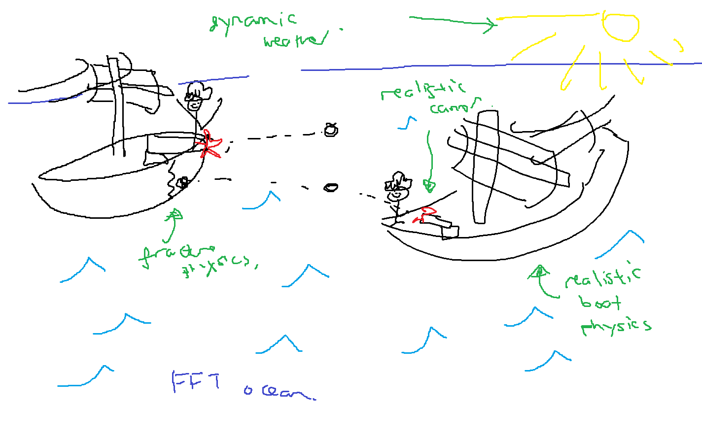

# Battleships Web Game

A free, open-source 3D web game where you battle your friends in the ocean

## Demo

<em>
A render achieved through mouse movement and Microsoft Paint depicting how I would like the game
to eventually look. There will be an Fourier Transform ocean, destructible boats, realistic boat physics and,
importantly, the ability to play with your friends.
</em>

## Tech Stack
- Game and Rendering logic will be in C++, compiled to WASM 
- Frontend for the website will be in vanilla HTML/CS/JS (because it's the first time I'm using it)
- Renderer will be WebGPU (so I can access compute shaders too)
- I may use C# / .NET backend for the website

## Features I want
- It's gotta be multiplayer, so that's gonna be fun (Host/Client model)
- I want an FFT Ocean, it'll be a main feature of the game
- I want cannon fire (projectile sim)
- I want realistic boat movement (buoyancy sim + sail aero sim) + a nice player controller
- I want fracture physics and destructible boats (probably less of a priority but a nice touch)
- I want you to be able to switch between first person and third person (is this too complicated?)
so you can steer in TPS and aim cannon in FPS
- I want a simple main menu UI where you can do single player practice, create a lobby, join a lobby, options
and (important) LEAVE FEEDBACK for the creator
- I want a modest selection of ships for people to sail - some customisation would be nice (like different sails)
- Maybe a login / friend system? less of a priority.  (c#/.net may help here)
- Need some weather (rain, sun, night, cloudy, stormy)
- I'll probably end up adding more but i hope that provides some idea of what I'm trying to do here

## Learning outcomes

By the end of this project, I want a solid understanding of:
- Web Dev (full stack)
- WebGPU
- Network programming
- Creating physics-based 3D multiplayer games

and I want to improve on my skills in
- Game Design
- Graphics Programming
- Physics Programming
- System / Software Design

