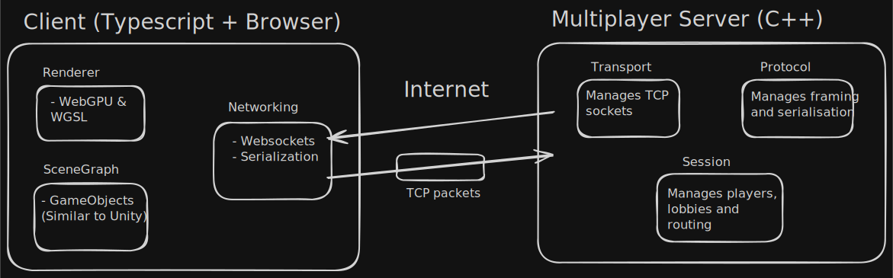

# TCP Multiplayer Server

A multiplayer server developed in C++ that uses the TCP protocol to allow users to create and join
lobbies and chat over the internet.

## Demo
Not much to see yet but here's the [demo](https://tommiedevelops.github.io/tcp-multiplayer-server/) 
if you're interested.

## Architecture

<em>
A rough sketch of the architecture. Client-side code will be in TypeScript, executed by a browser engine (e.g. v8). It will provide UI to host / join lobbies where a user can interact with other users in a simple 3D scene over the internet. The server side will be cloud-hosted C++ code with several networking layer to support a TCP connection over the internet.
</em>

## Rough Milestones
**Client**    
[x] Complete webgpufundamentals.org tutorial   
[ ] Load custom assets (mesh, textures)    
[ ] Render simple 3D scene with GameObjects

**Server**   
[ ] Simple TCP echo server (single client, get socket talking)   
[ ] Multi-client with poll()   
[ ] Simple chat server, handle disconnects cleanly    
[ ] Simple authoritative game server (reports Transform data)    
[ ] Simple lobby / matchmaking over the internet (Cloud hosting?)
